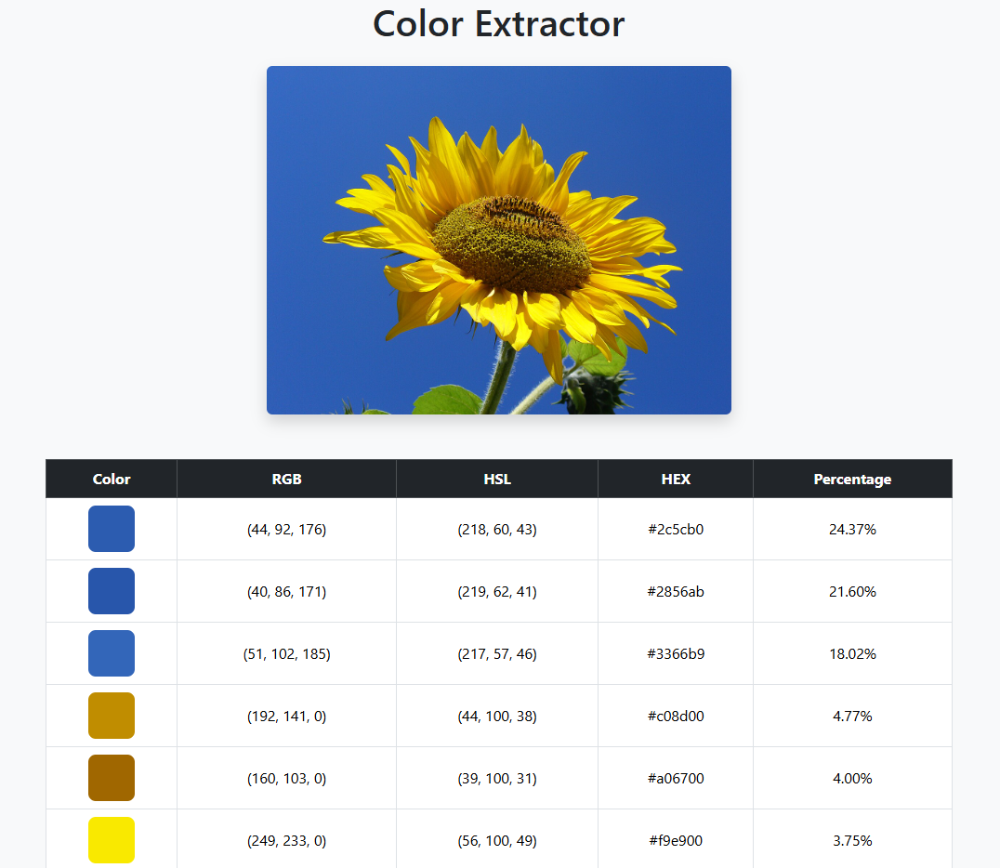

# Color Palette Website

**A Python Flask web app that extracts the colors of an uploaded image and creates a color palette from its most common colors.**



## Project Structure
- `color_extractor.py` — Extracts colors from the image.
- `main.py` — Runs the website and handles photo uploading.

## Features
- Shows a demo image with its extracted colors.
- Colors are clustered into 20 default clusters based on their RGB values, and the most frequent color in each cluster is selected as its representative color.
- Extracted colors are shown as RGB, HSL, HEX, and frequency percentage.
- The user can choose how many of the most common colors to show, between 5 and 20.
- The user can download the color palette as a CSV file.
- A UUID is generated for each user session. The uploaded image and CSV files are saved in a temp folder named after that UUID. The temp folder should be cleaned periodically.

## Technologies
- Python 3.13
- Flask, Flask-WTF, Flask-Reuploaded
- Pandas
- Numpy
- Scikit-learn
- Pillow (PIL fork)
- Standard library: `os`, `uuid`, `colorsys`

## Concepts Practiced
- Object-Oriented Programming (OOP)
- Reading configuration from environment variables
- Flask-WTF forms with CSRF protection
- K-means clustering algorithm
- Creating and modifying DataFrames
- Converting an image to a NumPy array and reshaping its dimensions
- Converting RGB values to HEX and HSL
- Reading and writing CSV files

## Credits
- The static visual design (HTML/CSS) was generated with AI and adapted for this project.
- All Python/Flask code, Jinja templating, and form integration are my own work.

## Configuration
The app requires the following environment variable at startup:
| Variable     | Purpose                                  |
|--------------|------------------------------------------|
| `SECRET_KEY` | Signs sessions and CSRF tokens           |

Generate a secret key with:
```bash
python -c "import secrets; print(secrets.token_hex())"
```

Then set it as an environment variable before running the app:
```bash
# Windows (PowerShell)
$env:SECRET_KEY = "your-secret-key"
```
```bash
# Windows (cmd)
set SECRET_KEY=your-secret-key
```
```bash
# macOS / Linux
export SECRET_KEY="your-secret-key"
```


## How to Run
Install the required packages:
```bash
pip install -r requirements.txt
```
Set the `SECRET_KEY` environment variable (see [Configuration](#configuration)).
Then run the program:
```bash
python main.py
```